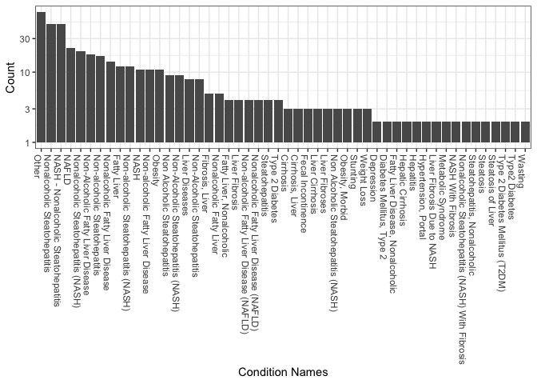
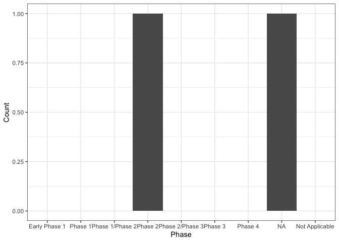

<!-- README.md is generated from README.Rmd. Please edit that file -->

# bis620.2023

<!-- badges: start -->

[](https://github.com/HouminXing/bis620.2022/actions/workflows/R-CMD-check.yaml)
[](https://github.com/HouminXing/bis620.2022/actions/workflows/test-coverage.yaml)
<!-- badges: end -->

The bis620.2023 package is developed as an extension of our midterm
project in BIS 620 Fall 2023. This package is structured to encompass a
comprehensive suite of functions and datasets used in our midterm
project.

Core Functionality: The core of the bis620.2023 lies the `start_shiny`
function. This function serves as a gateway to an interactive Shiny
application, designed to provide an user-friendly interface for
exploring the extensive data from clinicaltrials.gov trials. The
application is tailored to facilitate in-depth analysis and
visualization of clinical trial data.

## Installation

You can install the development version of bis620.2023 from
[GitHub](https://github.com/) with:

``` r
# install.packages("devtools")
devtools::install_github("HouminXing/bis620.2022")
```

## Example

This is a basic example which shows you how to solve a common problem:

``` r
library(bis620.2023)
accel |> 
  head(100) |> 
  plot_accel()
```


To start our shiny app, please use the following codes:

``` r
library(bis620.2023)
start_shiny()
```

Below are two examples that show some of the visualization features of
our shiny app:

``` r
# draw a histogram for trials with different conditions
data(studies)
data(conditions)
bis620.2023:::create_condition_histogram(studies = studies, 
                                         conditions = conditions,
                                         sponsor_type = 1, # ALL_SPONSORS
                                         status_type = 1, # ALL_STATUS
                                         brief_title_kw = "nash")
```



``` r
# draw a histogram for trials in different phases
data(studies)
bis620.2023:::create_phase_histogram_plot(studies = studies, 
                                          sponsor_type = "FED", 
                                          status_type = 1, # ALL_STATUS
                                          brief_title_kw = "nash")
```



The links to the test coverage page and R-CMD-check results:  
[R-CMD-check](https://github.com/HouminXing/bis620.2022/actions/workflows/R-CMD-check.yaml)  
[Test
Coverage](https://github.com/HouminXing/bis620.2022/actions/workflows/test-coverage.yaml)  
[Calculated Test Coverage
Score](https://app.codecov.io/gh/HouminXing/bis620.2022)
